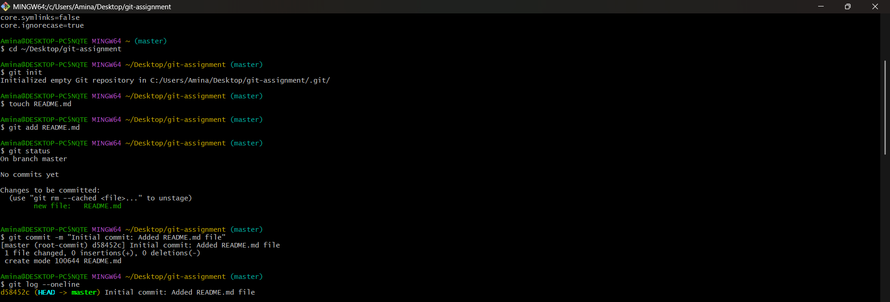
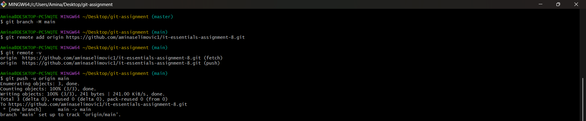
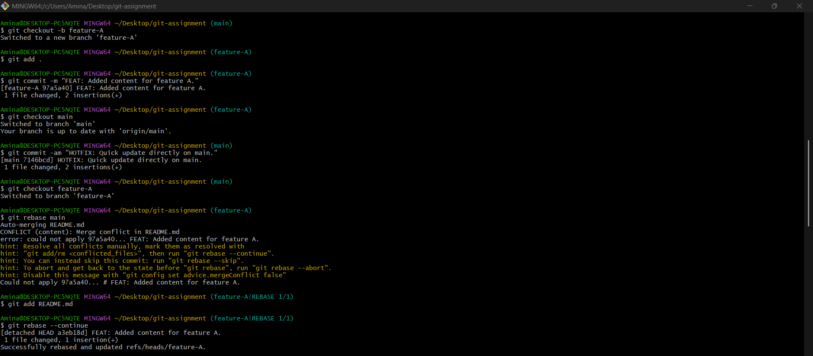
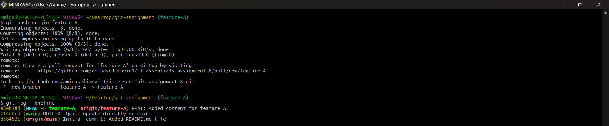
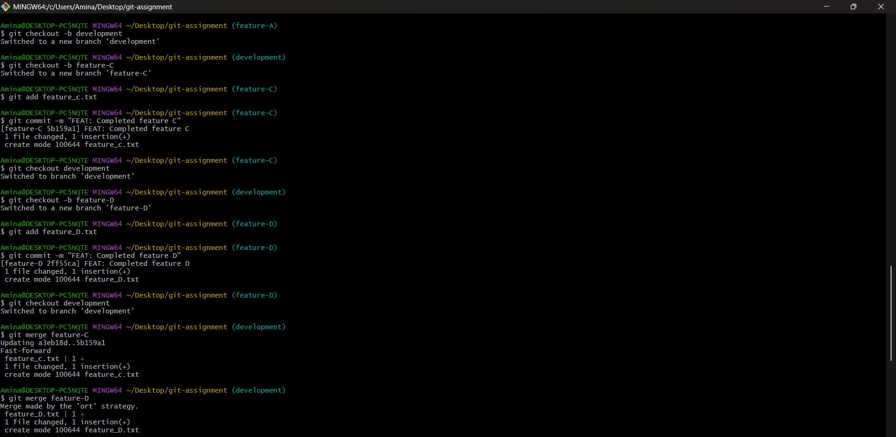
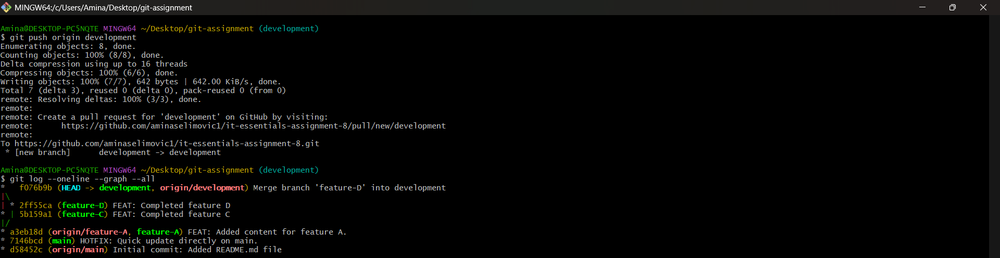

Quick update directly on main.
Working on feature A.

# IT Essentials – Git Assignment  
### Amina Selimović  
### Repository: it-essentials-assignment-8

This README contains all required screenshots proving the execution of each step in the assignment.  
The terminal was not cleared between commands, as requested.

All screenshots are included below.

---

## Phase 1 – Local Repository Initialization & First Commit

---

## Phase 2 – Remote Setup and Synchronization

---

## Phase 3 – Branching, Changes, and Rebase

---

## Phase 4 – Branch Integration (Merging Non-Main Branches)

